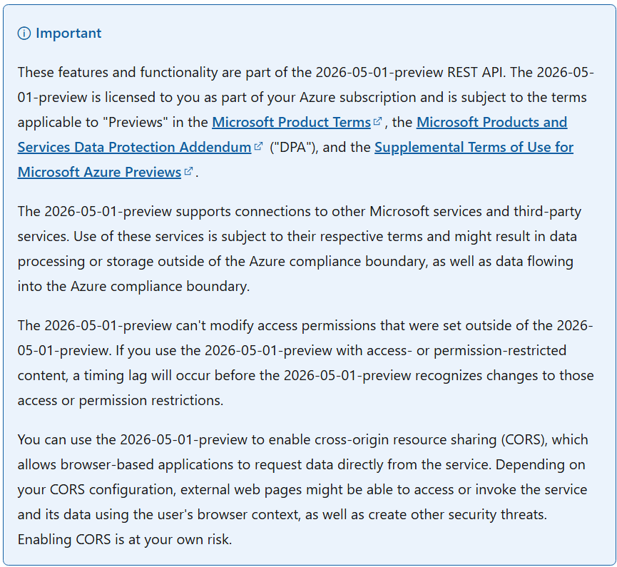
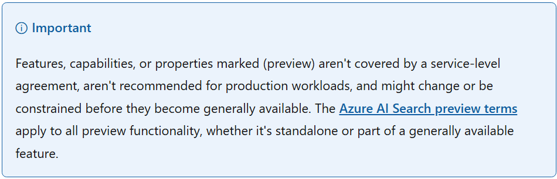

# Scalable model for preview disclosures

{: .no_toc }

As Azure AI Search introduced more preview functionality, it became clear that we needed a more scalable way to communicate preview status in our documentation. I developed an approach that separated general preview terms from feature-level status, making disclosures clearer for customers and easier for writers to maintain.

## Old approach

The existing approach relied on large inline notices that combined several types of information:

+ The preview API version and applicable legal terms
+ Disclosures about connections to Microsoft and third-party services
+ Data processing and compliance boundary considerations
+ Customer responsibilities for testing, safety, quality, and reliability
+ Links to additional legal and responsible AI documentation

Because the applicable terms varied by feature, these notices had to be tailored to individual features and embedded directly in articles. Each notice was also tied to a specific API version, so writers had to update individual notices whenever a new preview API version was released. Over time, this resulted in feature-specific notice variations across more than 100 articles.

For customers, the notices were long and visually prominent without clearly indicating which specific functionality was in preview, making it easy to interpret the entire article as being in preview. For writers, maintaining so many variations of lengthy legal language created a significant burden, especially when our legal team requested last-minute updates ahead of API releases.

## New approach

I established a three-part model that separated general preview terms from the status information customers needed at the article and feature level.

### Canonical preview-terms article

First, I moved the full legal and operational terms to a dedicated, version-agnostic article: [Azure AI Search preview terms](https://learn.microsoft.com/en-us/azure/search/search-preview-terms). Writers could link to the article instead of reproducing lengthy disclosures throughout the documentation.

### Reusable article-level notice

Second, I replaced the lengthy inline disclosures with a concise, reusable notice that gives customers the context they need when they encounter preview functionality in an article.

I implemented the notice through a shared include so writers could apply it consistently across articles. I also deliberately broadened the language to refer to "features, capabilities, or properties" rather than simply "features." This accounted for preview functionality that could apply to an entire feature or to a more granular capability or property.

### Inline `(preview)` labels

Finally, I established criteria for placing `(preview)` labels based on the scope of the preview functionality:

+ **Entire feature in preview:** Add `(preview)` to the corresponding TOC entry, H1, and the feature's first mention in the article.

+ **Specific capability or property in preview:** Add `(preview)` to the relevant subsection heading or another appropriate location identifying that functionality.

+ **References to preview functionality:** Add `(preview)` to subsequent references when needed to make the preview status explicit.

## Impact

I turned a recurring documentation problem into a scalable process that could accommodate new Azure AI Search preview functionality and changing requirements. Writers no longer had to revisit individual disclosures for every new preview API release or legal update, and customers could see more precisely which features, capabilities, or properties were in preview.

---

[Back to top](#top)

Thanks for visiting my portfolio! If you have any questions or feedback, please feel free to reach out.
