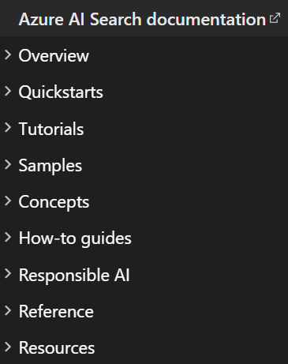
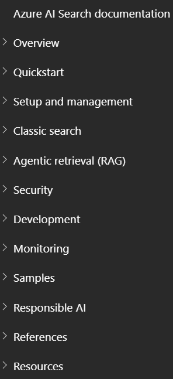

# Reframing Azure AI Search navigation
{: .no_toc }

When I joined the Azure AI Search team, its documentation TOC was organized primarily by content types. I saw an opportunity to improve the navigation based on how customers experience the product.

## Old content-type TOC

Nodes in the existing TOC represented quickstarts, tutorials, samples, how-to guides, and other content types. As a new contributor, I found this structure difficult to interpret because it reflected how writers organized their work rather than how Azure AI Search was organized.

Azure AI Search was evolving, too. Our product team was investing heavily in agentic retrieval, a new approach to retrieval-augmented generation that was becoming an important part of the product's direction. At the same time, data showed that 97% of customers were still using the established search experience.

The challenge, therefore, was to make the TOC serve where the product was headed without losing sight of how most customers were using it today.

## New capability-based TOC

I redesigned the TOC around product capabilities rather than content types, grouping related guidance by what customers could do with Azure AI Search. I also reorganized the hierarchy to create a more logical progression from initial evaluation and setup to more advanced use cases.

As part of this work, I adopted the established industry term "classic search" to describe the search architecture that preceded agentic retrieval. With our product team's support, I later extended the term beyond the TOC into individual articles. What began as a navigation term evolved into shared vocabulary for describing Azure AI Search's two retrieval modes across the documentation.

## Impact

Although I wanted to conduct formal usability testing to measure the new TOC's effectiveness, I wasn't able to do so. I did, however, host an internal "bug bash" in which stakeholders tested the new structure and found the flatter hierarchy more intuitive.

For me, the larger lesson was that being user-centric often means removing layers rather than adding them. When I stopped organizing the documentation around inherited conventions and instead focused on how customers use the product, it became clear that the old content-type structure was an unnecessary layer. This lesson has shaped how I approach information architecture and, more broadly, how I design documentation around the customer's journey.

---

[Back to top](#top)

Thanks for visiting my portfolio! If you have any questions or feedback, please feel free to reach out.
